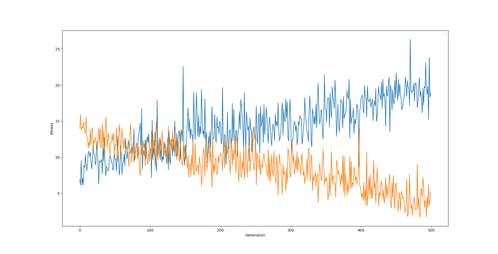

# **Assignment 2 Report**
- Name: Wayne Gee
- ID: 8482738
## **Description and reasoning for the choice of the model of the agent function.**
I used a single layer neural network model for the agent function. It takes a number of inputs and then it factors in the weights to produce a output.
Because the output does not need a particular range, I did not need to use a threshold function.
The reason why I used a single layer neural network was because a multi layer took much longer to compute all the calculations.<br>
The single layer neural network works by assigning genes to each of the inputs, then neuron then sums up all the incoming values and gives a output. 
So when the weights have a low strength/value, it affects the decision of the output.
## **A description and reasoning for the choice of the chromosome that governs the model parameters.**
I have found that using uniform random to select a random number from -2 to 2 makes the agent learn faster. Values close to zero help reduce the strength of the input, and Negative weights help flip its magnitude. I used to use -1 to 1, but I figured that having larger numbers has a quicker impact on the agent function.
## **A graph showing how average fitness of the population changes as evolution proceeds.**
These are graphs of the fitness before I normalized it.
### <center>**myAgent vs randomPlayer**</center>

### <center>**myAgent's fitness**</center>

### <center>**myAgent vs randomPlayer**</center>

### <center>**myAgent's fitness**</center>

# **A description of your genetic algorithm - the method and parameters of selection, cross-over and mutation.**
For each generation, my genetic algorithm first calculates the factor of the perceptrons with the weight (chromosome) of the creature. The result being the output for the action. A fitness value is then applied to each of the creatures according to the behaviour shown when it is training. Two parents are then picked randomly based off of their fitness. Using random selection, a new creature is then made up of a equal mix of both the parents genes.
Mutation and elitism is then applied to the population.
### **Selection**
```python
# k-way tournament selection to find best parent
def k_way_tournament_selection_best(k, fitness):
    bestparent = random.randint(0,33)
    for i in range(0,k):
        newparent = random.randint(0,33)
        if fitness[newparent] > fitness[bestparent]:
            bestparent = newparent
    return bestparent
```
Tournament selection randomly picks k amount of parents. It the chooses the best out of the k amount.
```python
# Roulette wheel selection to find parent
def roulette_selection(fitness):
    pick = random.uniform(0, sum(fitness))
    current = 0
    for n in range(0,34):
        current += fitness[n]
        if current > pick:
            return n
```
Roulette selection randomly picks a parent, with the parents of higher fitness having a higher chance of getting picked.
<br><br>
I have tried both the k-way tounament selection and the roulette selection. And I came to the conclusion that roulette selection is better from all the tests. But I still used tournament selection to pick parents for elitism.
### **Crossover**
```python
# Random crossover
for i in range(0, chromaLength):
    if random.randint(0, 1) == 0:
        new_creature.chromosome[i] = (old_population[first_parent].chromosome[i])
    else:
        new_creature.chromosome[i] = (old_population[second_parent].chromosome[i])
```
I used random cross-over which has a equal chance to pick randomly between the two parents for each gene in the chromosome. 
### **Mutation**
```python
# Mutation
for i in range(0, chromaLength):
    if random.randint(0,mutation_chance) == 0:
        new_creature.chromosome[i] = random.uniform(-2,2)
```
I made the mutation function have a really low chance of mutation for each gene. But the chance increases when more creatures die.
## **A discussion of the results and how the evolution shaped your creatures’ behaviour.**
When the creature starts living in the first generation, it doesn't know anything. Some creatures may have good behaviours, most do not. At the end of the generation, the useless creatures are removed and the creatures with useful behaviours combine their genes to create the next generation. After about 50 generations, the creatures develop good behaviours which help them survive.<br>
I have found that when the creatures die too fast, the creatures can not learn very well. This is from myAgent versing the hunterPlayer. So I have tried to implement something which still helps them learn even though they die too fast, but to no avail. These things I tried to implement is the mutation behaviour and elitism number, they increase/decrease as more creatures die/survive.